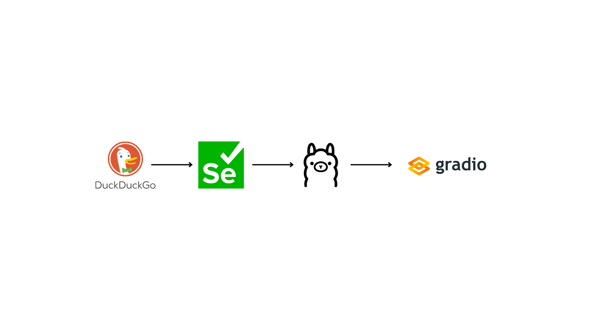
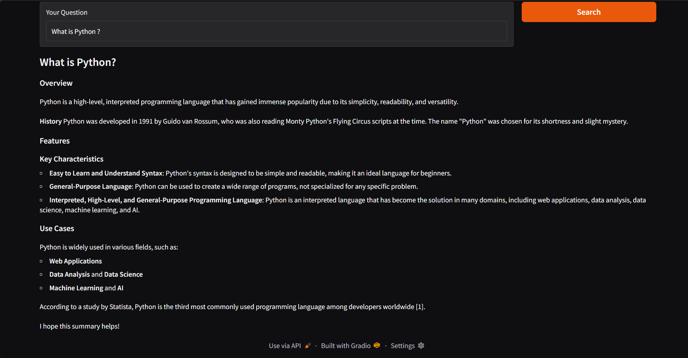

# Automated-Web-RAG-Pipeline

This project presents a comprehensive, end-to-end Retrieval-Augmented Generation (RAG) system designed to perform live web research, semantic content retrieval, and AI-powered summarization. Given a natural-language user query, the system automatically searches the web, scrapes relevant websites in real time, processes and embeds the extracted content, retrieves the most relevant information, and synthesizes a high-quality answer using a locally hosted Large Language Model (LLM).

Unlike static knowledge-base chatbots or offline RAG systems, this project operates on live web data, demonstrating how modern data engineering, information retrieval, and LLM inference can be combined into a unified, production-style pipeline. The system is fully local, tool-agnostic, and exposed through an interactive Gradio interface for easy experimentation and demonstration.

# Workflow Overview

# System Architecture & Pipeline Components

The project is structured into modular components that together form a complete Search → Scrape → Retrieve → Generate pipeline.

   1. Live Web Search & Navigation (Selenium + DuckDuckGo):

      - Uses Selenium WebDriver to automate live web searches through DuckDuckGo.

      - Accepts a free-form user query and submits it directly to the search engine.

      - Collects organic search results dynamically without relying on paid APIs.
     
      - Opens each result in a separate browser tab to ensure isolation and stability.
     
      - Designed to work with any Chromium-based browser, keeping the search engine and browser choice decoupled.

   2. Web Scraping & Content Extraction:
      
      - Visits each discovered website and extracts meaningful textual content.

      - Each website is converted into clean, structured text, ready for downstream processing.

   3. Text Chunking & Semantic Embeddings:

      - Aggregates scraped content from all websites into a unified text corpus.

      - Applies recursive text chunking to split large documents into overlapping, context-preserving chunks.
     
      - Converts each chunk into a dense vector embedding using a SentenceTransformer model.
     
      - Embeds the user query using the same embedding space.

   4. Vector Similarity Retrieval (Retrieval Layer):
    
      - Computes cosine similarity between the user query embedding and all text chunk embeddings.
     
      - Selects the top-k most semantically relevant chunks.
     
      - This retrieval layer ensures the LLM reasons only over relevant, grounded content rather than raw scraped data.
     
   5. LLM-Based Answer Synthesis (Ollama – LLaMA 3.2):

      - Integrates a locally hosted LLM using Ollama (LLaMA 3.2).
     
      - Injects the retrieved text chunks as contextual knowledge.
     
      - Streams responses token-by-token for real-time feedback.
     
   6. Interactive User Interface (Gradio):

      - Provides a clean, web-based Gradio interface
     
      - Users can:

         - Enter any natural-language question

         - Observe live pipeline progress

         - Receive a structured, summarized response

      - Displays streamed LLM output in real time for improved UX.

